# Slack Setup for Snowflake Cortex Agent MCP Integration

This guide walks you through setting up a Slack trial workspace and configuring it to work as an MCP (Model Context Protocol) server. A Cortex Agent in Snowflake will later connect to this MCP Server using the Cortex Agents MCP Connector feature.

**Reference documentation:** [Cortex Agents MCP Connectors](https://docs.snowflake.com/en/user-guide/snowflake-cortex/cortex-agents-mcp-connectors)

By the end of this guide you will have:

1. A new Slack workspace (`snowflake-demo-slack`).
2. A Slack App (`cortex-agents-mcp-integration`) with MCP enabled, proper Redirect URL, and scopes.
3. Client ID and Client Secret ready for creating a Snowflake API Integration.
4. A dedicated `#acme-corp` channel populated with two sample messages that the Cortex Agent will later retrieve through the MCP connector.

---

## Step 1 — Create a new Slack workspace

Navigate to [https://slack.com/get-started#/createnew](https://slack.com/get-started#/createnew) and start the workspace creation flow.

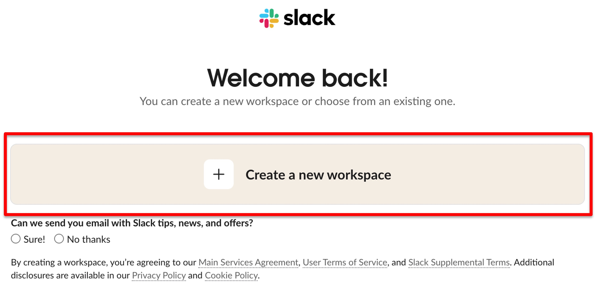

## Step 2 — Name your workspace

Provide a workspace name. For this demo we use `snowflake-demo-slack`.

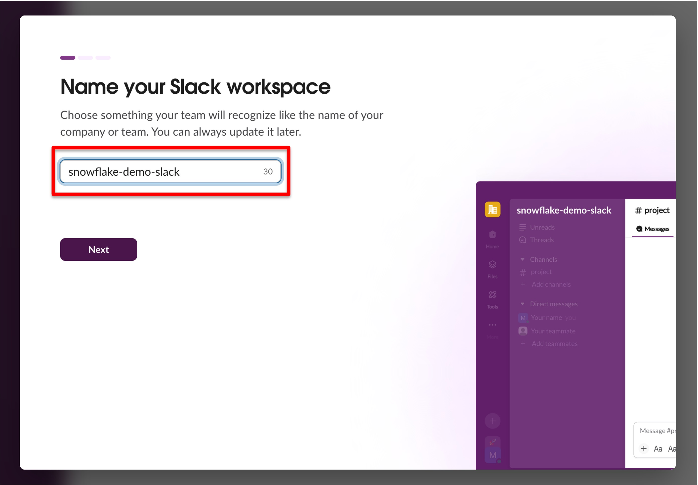

## Step 3 — Choose the Free plan

Click **Continue with Free**. The Pro plan is not required for this integration.

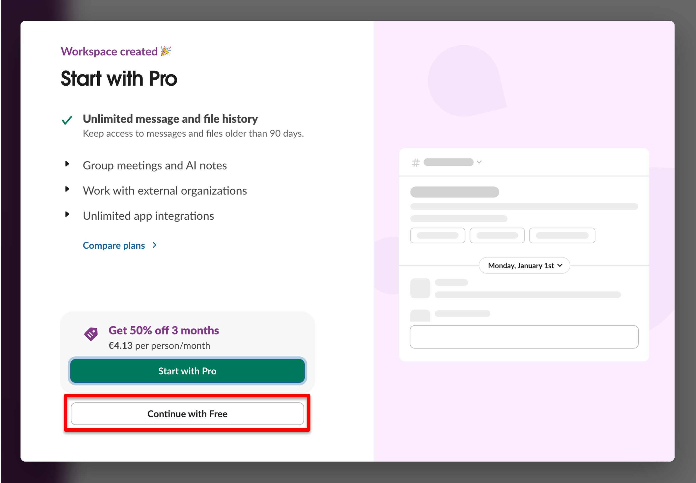

## Step 4 — Open Apps & workflows

Once the workspace is ready, the Slack interface will load. Click **Admin**, then select **Apps & workflows**. This opens the **Installed apps** page.

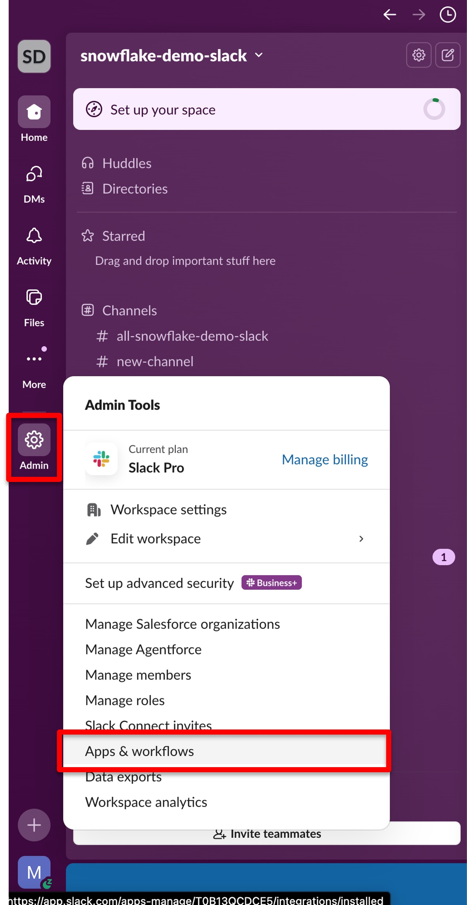

## Step 5 — Build a new app

In the top right corner of the Installed apps page, click **Build**.

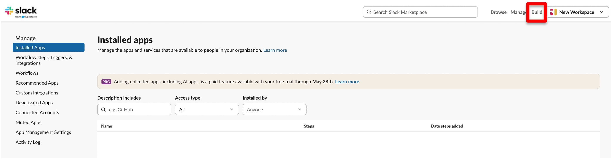

## Step 6 — Create New App

You will be presented with a list of your existing apps (likely empty). Click **Create New App**.

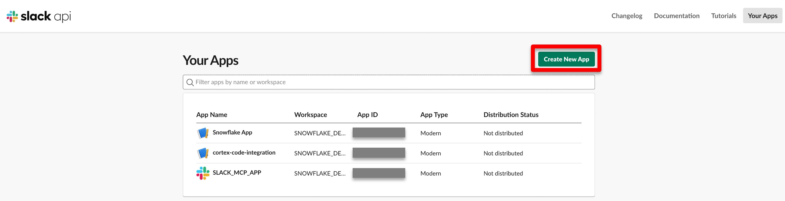

## Step 7 — From scratch

Select **From scratch**.

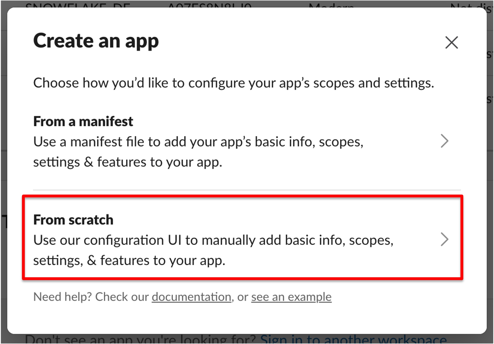

## Step 8 — Name the app and pick the workspace

- **App Name:** `cortex-agents-mcp-integration`
- **Workspace:** make sure `snowflake-demo-slack` is selected

Then click **Create App**.

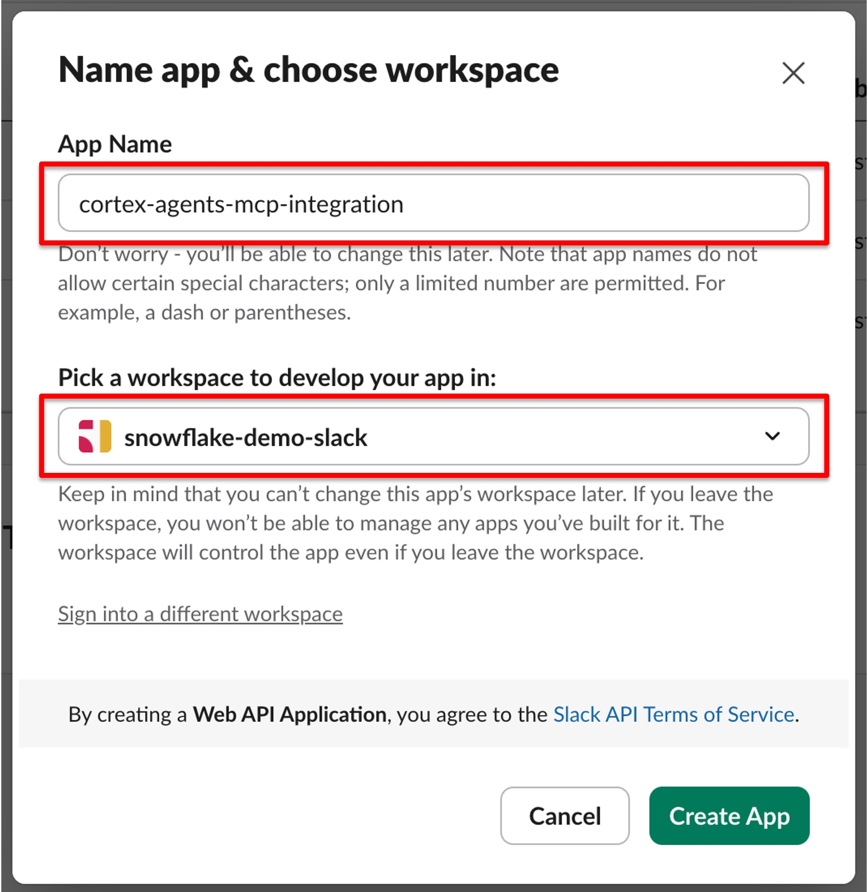

## Step 9 — Capture Client ID and Client Secret

On the **Basic Information** tab, note down the **Client ID** and **Client Secret**. You will need both values later when creating the API Integration in Snowflake.

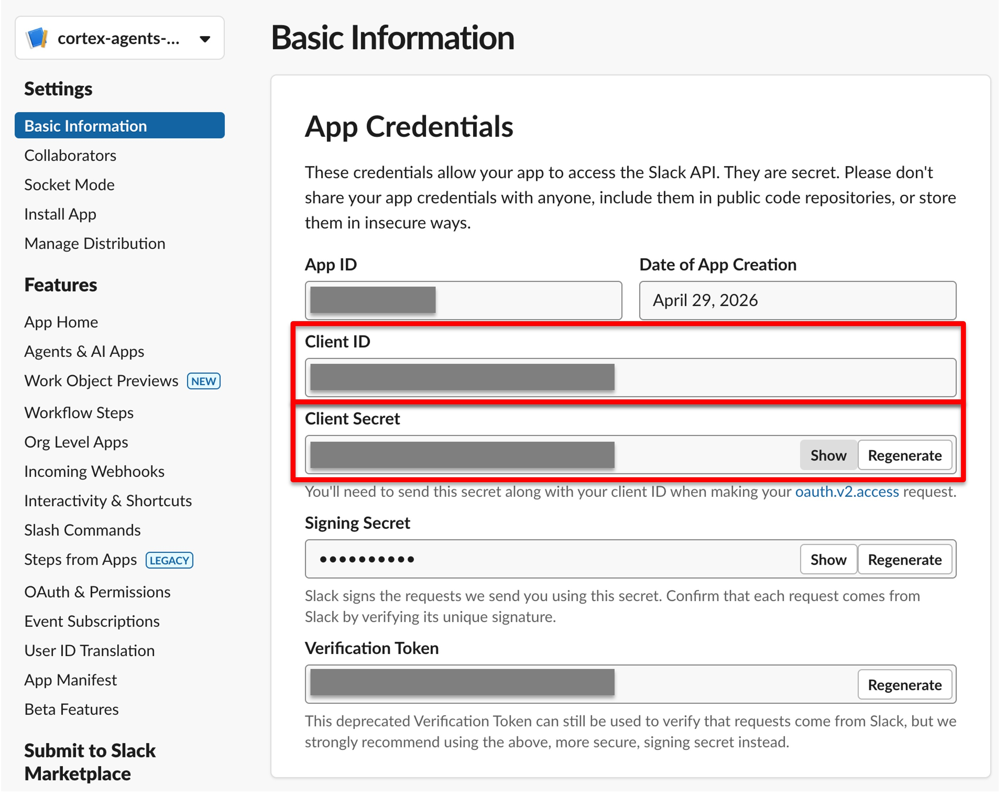

## Step 10 — Enable Model Context Protocol

Switch to the **Agents & AI Apps** tab and enable **Model Context Protocol**.

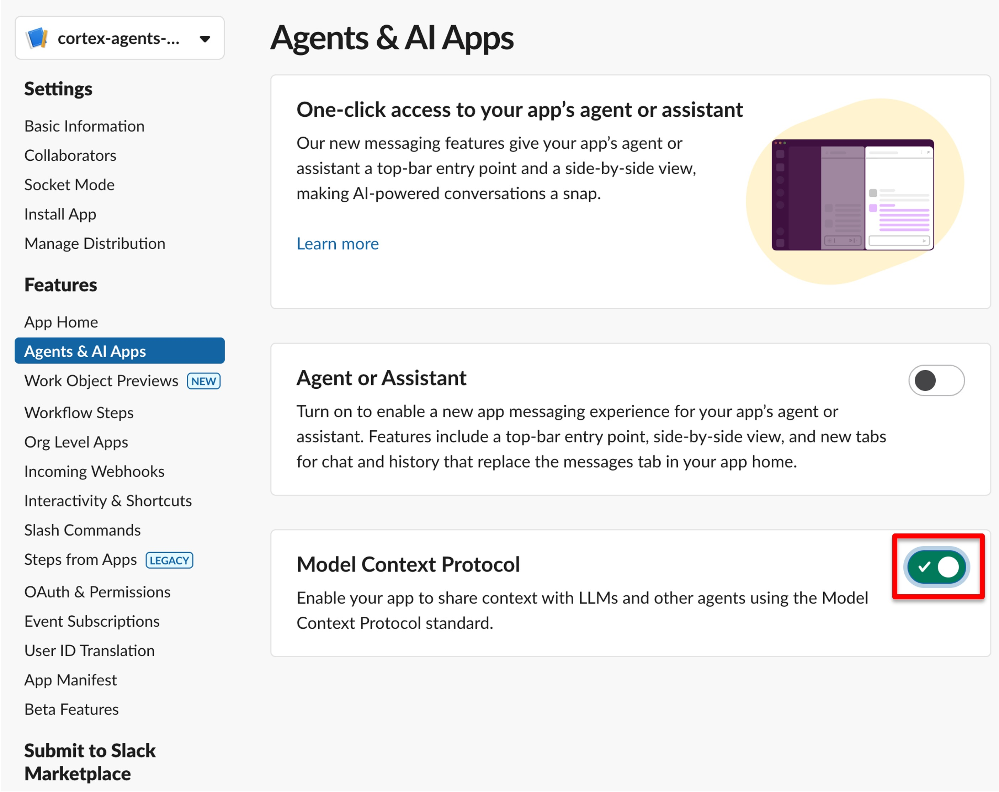

## Step 11 — Add the Redirect URL

On the same tab, add the Snowflake OAuth redirect URL:

```
https://identity.snowflake.com/oauth2/callback
```

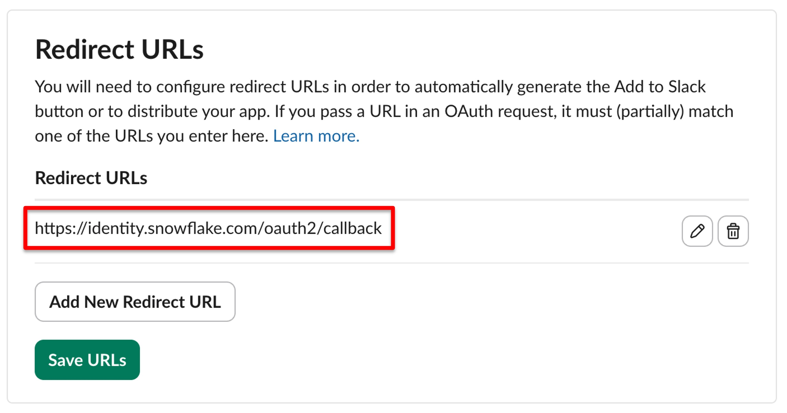

## Step 12 — Verify scopes

Still on the **Agents & AI Apps** tab, review the scopes. Enable whatever Bot/User Token Scopes your application requires.

For this demo, only two **Bot Token Scopes** were added and the **User Token Scopes** defaults were left as-is.

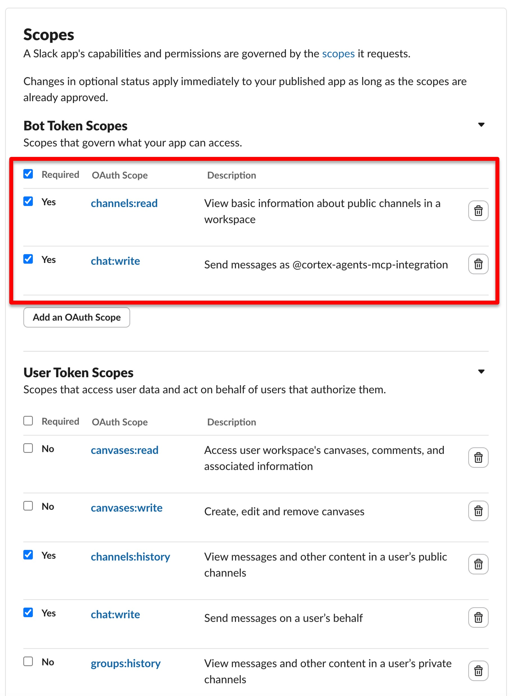

## Step 13 — Install the app to the workspace

Scroll back to the top and click **Install to snowflake-demo-slack**.

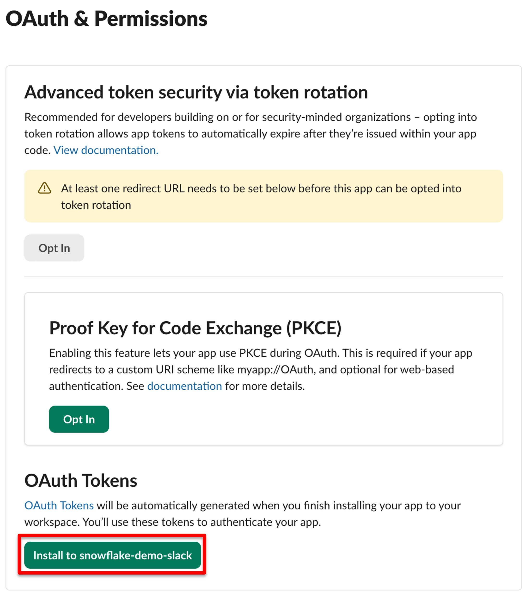

## Step 14 — Create a channel for Acme Corp

Our demo scenario assumes there is a customer called **Acme Corp**. Create a new Slack channel for the sales team covering this account.

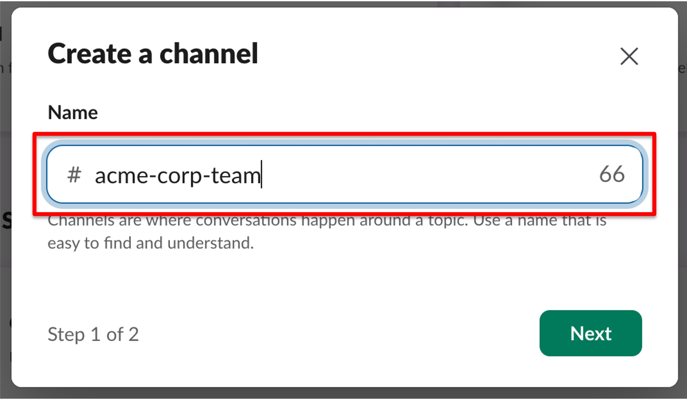

## Step 15 — Make the channel public

Set the channel visibility to **Public** so the Cortex Agent can access the messages through the MCP connector.

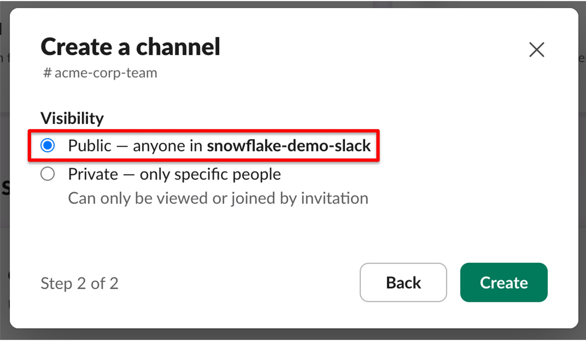

## Step 16 — Post the sample messages

Copy and post the following two messages into the new `acme-corp` channel. The Cortex Agent will later retrieve these messages via the MCP connector.

**Message 1:**

```
Call Summary — Acme Corp
Had a 30-min sync with Jennifer Walsh (Sr. Director of Data Engineering) and Tom Reyes (FinOps Lead) today.

Main topic:
They flagged a significant spike in Snowflake credit consumption that occurred. The spike caught their FinOps team off guard when they reviewed their cost dashboard this morning.

They don't have visibility into what drove it and are asking us to help investigate.

Ask:
:mag: Can someone from the account team or CE help pull a consumption breakdown for Acme's account?
```

**Message 2:**

```
Call Summary — Acme Corp
The FinOps team says they plan to reduce consumption until the investigation of the spike has finished.
```

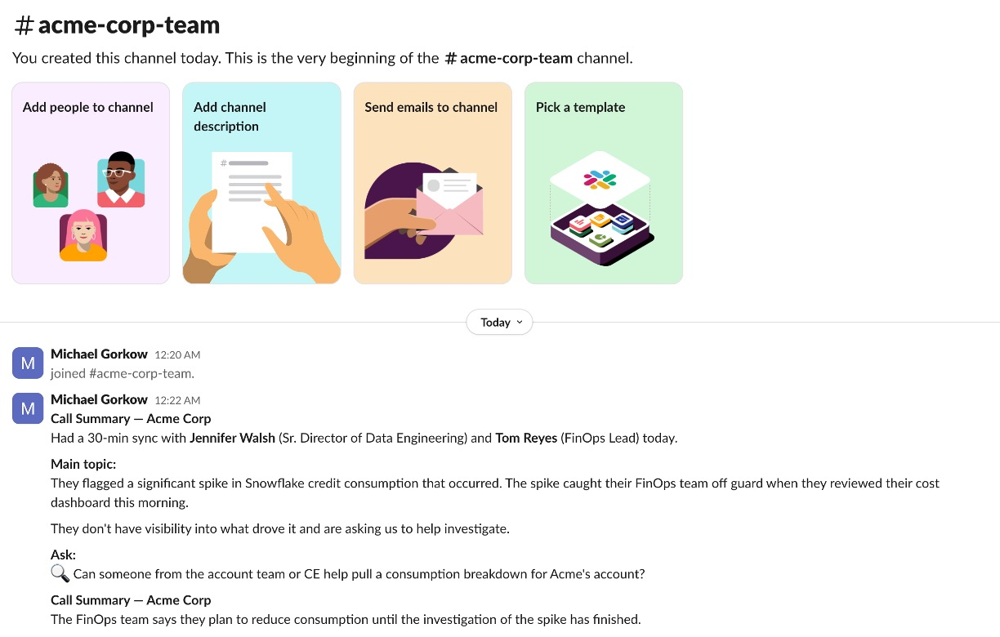

---

## Next steps

With the Slack workspace, app, and sample channel in place, you now have everything you need to:

1. Create a **Snowflake API Integration** using the Client ID and Client Secret you captured in Step 9.
2. Configure a **Cortex Agent** with the Slack MCP connector following the [official documentation](https://docs.snowflake.com/en/user-guide/snowflake-cortex/cortex-agents-mcp-connectors).
3. Ask the agent about Acme Corp — it will surface the two sample messages you posted in Step 16.
