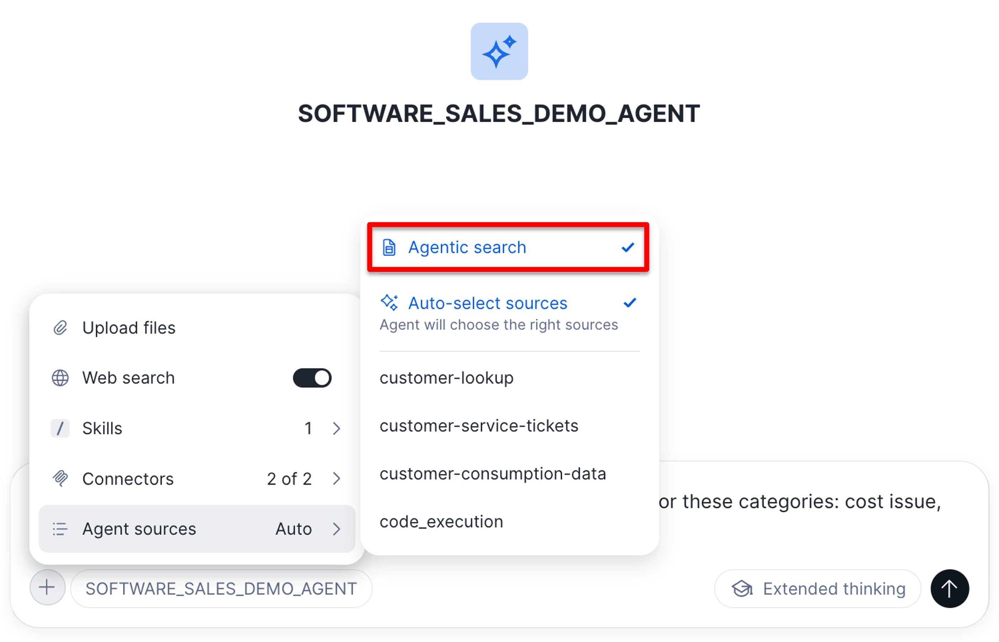
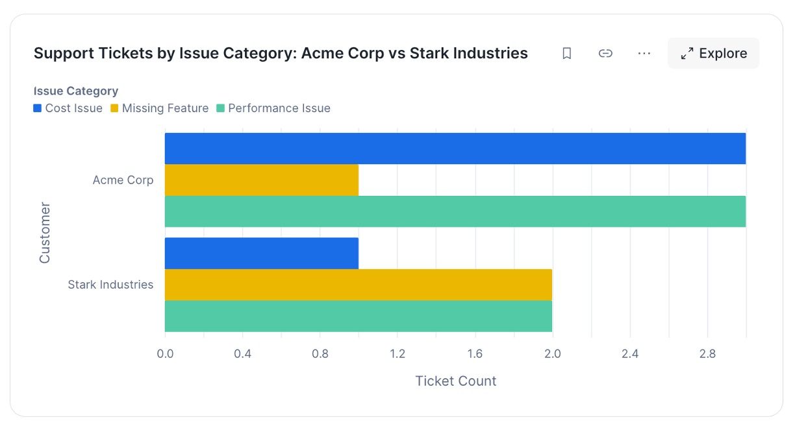
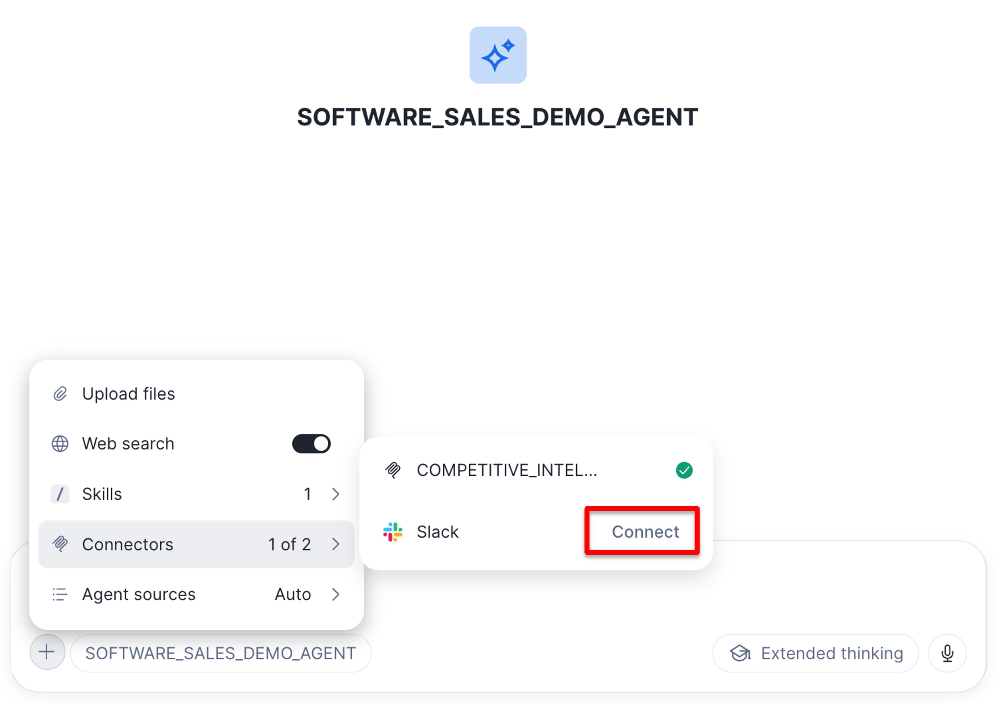
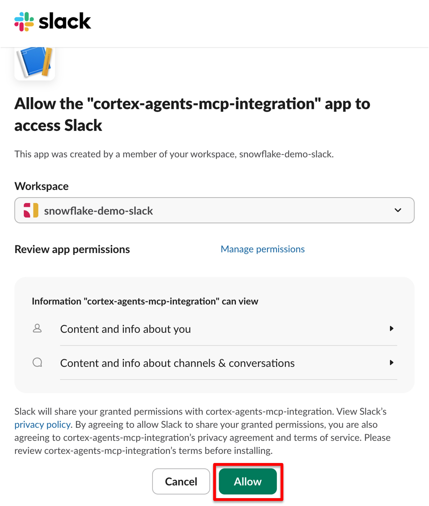

# Snowflake Cortex Agents: Software Sales Demo

An end-to-end demo that shows how to build a **Sales Support Agent** in Snowflake using **Cortex Agents**, **Semantic Views**, **Cortex Search**, **Custom Skills**, **Code Execution**, **MCP Connectors**, and **Agentic Search**.

---

## Use Case Description

This demo simulates a sales organization (modeled after Snowflake) that needs an AI-powered assistant to help Sales Directors and Account Executives make better, faster decisions. The fictional company has:

- **Customer usage data** (credit consumption) stored in Snowflake tables
- **Customer service tickets** stored in Snowflake tables
- **Slack** as its primary collaboration and communication tool
- **Competitors** such as AWS, Azure, GCP, and Databricks

The resulting `SOFTWARE_SALES_DEMO_AGENT` is exposed through **Snowflake Intelligence** and combines multiple agent capabilities into a single conversational experience.

### Example Use Case 1 — Sales Director: Investigating a Consumption Drop

1. The Sales Director opens **Snowflake Intelligence** and selects the `SOFTWARE_SALES_DEMO_AGENT`.
2. They ask for a visualization of **ACME Corp's credit consumption for the last 30 days** and notice a sudden drop.
3. They ask the agent to **search Slack** for context — the agent uses the **MCP Slack connector** and surfaces two messages mentioning calls with the customer: the customer's FinOps team paused consumption after an unexpected usage spike pending an investigation.
4. The Sales Director asks for a **credit consumption forecast** for ACME Corp. The agent invokes a **custom skill** that runs a **Python Prophet** model via the **Code Execution Tool**, producing a dynamic HTML visualization and a static PDF report.
5. Finally, they ask the agent to **summarize the insights and post them to the ACME Corp Slack channel** so the account team is aligned on the consumption drop and its forecasted impact.

### Example Use Case 2 — Account Executive: Competitive Intelligence

1. The Account Executive opens **Snowflake Intelligence** and selects the `SOFTWARE_SALES_DEMO_AGENT`.
2. A prospect is evaluating Snowflake against **Databricks, Microsoft Fabric, AWS Redshift, and Google BigQuery**.
3. The AE asks the agent for **the latest news about Snowflake and its competitors**, as well as **social media insights**.
4. The main agent delegates to a specialized **sub-agent** (another Cortex Agent connected via MCP) that uses **Snowflake Web Search** to retrieve news and social content.
5. The sub-agent returns a **structured response with actionable talking points** the AE can use in their next customer conversation.

### Example Use Case 3 — Sales Engineer: Analytical Insights via Agentic Search

1. A Sales Engineer opens **Snowflake Intelligence** and selects the `SOFTWARE_SALES_DEMO_AGENT`.
2. They want to understand the distribution of service tickets across three categories: **Cost Issue**, **Performance Issue**, and **Missing Feature**.
3. They enable **Agentic Search** in Snowflake Intelligence to allow analytical queries over unstructured data:
   
4. He asks: 
    > Please provide a breakdown of support tickets for Acme Corp and Stark Industries, categorized by the following issue types: Cost Issue, Performance Issue, and Missing Feature. How many tickets were logged under each category for each account?
4. Agentic Search leverages Snowflake's built-in **AI Functions** to dynamically classify each service ticket and aggregate the results using standard SQL.
5. The output is rendered as a clear, easy-to-interpret chart, enabling rapid consumption of the insights and supporting further deep-dive analysis.
    

---

## Requirements

To run this demo you will need:

- A **Snowflake account** with access to:
  - Cortex Agents and Snowflake Intelligence
  - Cortex Search Services
  - Semantic Views
  - **Private preview features**:
    - [Code Execution Tool](https://docs.snowflake.com/en/user-guide/snowflake-cortex/cortex-agents-code-execution-tool)
    - [MCP Connectors](https://docs.snowflake.com/en/user-guide/snowflake-cortex/cortex-agents-mcp-connectors)
    - [Agentic Search](https://docs.snowflake.com/en/LIMITEDACCESS/agentic-search)
- A **Slack workspace** (a free trial workspace is sufficient) where you have admin rights to create an app and install it
- An `ACCOUNTADMIN`-capable Snowflake user to run the initial environment setup
- Access to GitHub to clone this repository as a Snowflake Workspace

### Agent Capabilities

The `SOFTWARE_SALES_DEMO_AGENT` uses the following Snowflake features:

| Capability | Feature | Purpose |
|---|---|---|
| Structured analytics | [Semantic Views](https://docs.snowflake.com/en/user-guide/views-semantic/overview) | Query customer credit consumption |
| Unstructured search | [Cortex Search Services](https://docs.snowflake.com/en/user-guide/snowflake-cortex/cortex-search/cortex-search-overview) | Search customer service tickets, lookup customer names |
| Forecasting | [Custom Skill](https://docs.snowflake.com/en/user-guide/snowflake-cortex/cortex-agents-skills) + [Code Execution Tool](https://docs.snowflake.com/en/user-guide/snowflake-cortex/cortex-agents-code-execution-tool) | Prophet-based credit consumption forecasts |
| Market intelligence | Custom Skill + [Web Search](https://docs.snowflake.com/en/user-guide/snowflake-cortex/cortex-agents#web-search) | Retrieve and analyze news about Snowflake and competitors |
| Communication | [MCP Connector](https://docs.snowflake.com/en/user-guide/snowflake-cortex/cortex-agents-mcp-connectors) | Search and send Slack messages |
| Analytical questions over unstructured data | [Agentic Search](https://docs.snowflake.com/en/LIMITEDACCESS/agentic-search) | e.g. "how many service tickets per category?" using `AI_CLASSIFY` |

---

## Demo Setup

Follow these steps in order. Each numbered folder in the repository corresponds to a stage of the setup.

### 1. Create and Configure a Slack Workspace

Create a free **Slack trial workspace** and configure the Slack app required by the MCP connector by following the instructions in:

```
1-1-admin-setup-slack/
```

This step provisions the Slack app, channels, and tokens the agent will use to read and post messages.

### 2. Set Up the Snowflake AI Environment

Log in to Snowflake with a privileged role (e.g. `ACCOUNTADMIN`) and run:

```
1-setup-ai-environment.sql
```

This script provisions a dedicated demo user and grants it all roles, warehouses, and object-level privileges required to build the agent.

> [!IMPORTANT]
> Make sure to replace <slack-client-id>, <slack-client-secret> and <your-password> with your values.

### 3. Log In as the Demo User

Log out and log back in to Snowflake with the **newly created demo user** from Step 2. All subsequent work is performed as this user.

### 4. Create a Workspace from the Git Repository

In Snowsight, create a new **Workspace** from this Git repository:

```
https://github.com/michaelgorkow/snowflake-cortex-agents-software-sales-demo.git
```

### 5. Run the Development Scripts

From the Workspace, execute all scripts in the following folders **in order**:

1. `2-1-ai-dev-generate-data/` — generates synthetic customer credit consumption data and service tickets
2. `2-2-ai-dev-setup-services/` — creates the Cortex Search Services, Semantic Views, custom skills, and MCP connectors
3. `2-3-ai-dev-setup-agents/` — creates the main `SOFTWARE_SALES_DEMO_AGENT` and the competitive-intelligence sub-agent

Once all scripts have completed successfully, open **Snowflake Intelligence**, select the `SOFTWARE_SALES_DEMO_AGENT`, and try the example use cases described above.


Before using Slack, a one-time authentication is required. Click the `+` icon, select the Slack connector, and choose `Connect` to complete the authorization flow:


